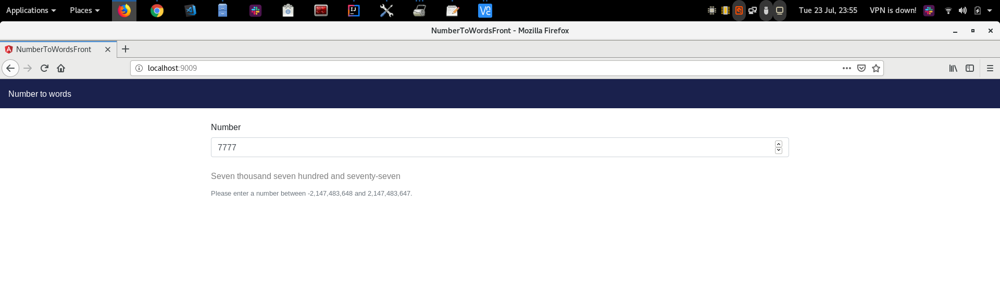

# number-to-words

The application is accessible from anywhere http://johannatestnumber.us-east-1.elasticbeanstalk.com:9009/ 

---------------------------------------------------------------------------------------------------------
1.To build the application:

mvn clean install

2.To launch the application please run the following command:

java -jar number-to-word-1.0.0-SNAPSHOT.jar

3.To request a number conversion:

- You can access the UI from your browser by the URL:
    
In your local environment http://localhost:9009

Or from anywhere http://johannatestnumber.us-east-1.elasticbeanstalk.com:9009/ 
    

- You can call the service using http get from your browser :

    http://localhost:9009/convertToWord/89 

**89** is the number to convert, please change it with the number you wish to convert

The CI pipeline :

https://gitlab.com/johannarojasgon/number-to-words/pipelines
